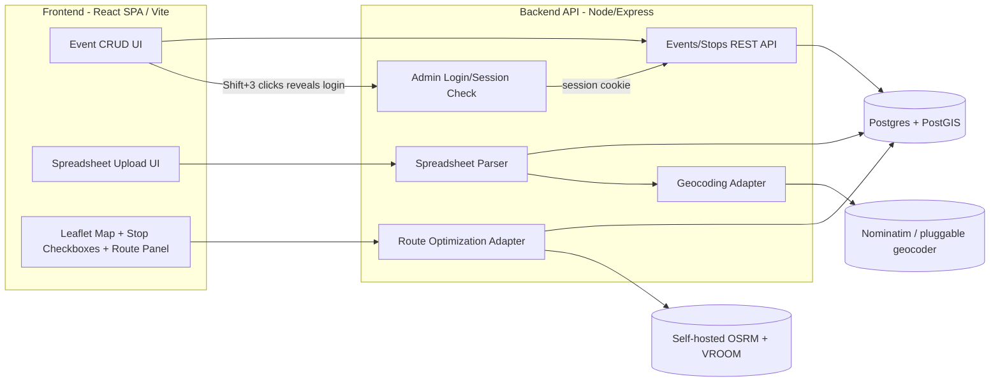

# Yard Sale Mapper — Roadmap

A web app for creating/managing yard-sale "events" (e.g. a town-wide yard sale),
uploading a spreadsheet of participating addresses, and generating the fastest
driving **circuit route** (start at home → hit every stop → return home).

---

## 1. Goals / Non-Goals

**Goals**
- CRUD for Yard Sale **Events** (name, date, description, status).
- Bulk-import stops via spreadsheet (CSV/XLSX) of addresses per event.
- Geocode addresses to lat/lng automatically, with a way to fix failures.
- Given an event + a user's starting address, let the user **check/select which
  stops they actually want to visit** (not necessarily all of them), then compute
  an optimized **round-trip** driving route over just that selection (a solved
  Traveling Salesman Problem over real road distances) when they click **"Calculate Route."**
- Visualize the event's stops and the computed route on an interactive map.
- Let the user hand off the final route to a real navigation app for turn-by-turn.

**Non-Goals (v1)**
- Real-time multi-driver dispatch / live tracking.
- Public social features (reviews, photos of items, chat).
- Perfect exact-optimal TSP for very large stop counts (heuristic is fine).

---

## 2. The Core Technical Problem

This is really two solved problems chained together:

1. **Geocoding** — turn addresses into coordinates.
2. **Open (or closed) TSP over a road network** — "visit all these points starting
   and ending at X with minimum drive time" — this is exactly the `Trip`/`Optimization`
   endpoint that open-source routing engines already provide. We don't need to hand-roll
   a TSP solver against straight-line distance; we want *real driving-time* distances,
   which means the routing engine must own both the distance matrix and the solve.

### Open-source routing options (recommended path)

| Engine | What it gives you | Notes |
|---|---|---|
| **OpenRouteService (ORS)** | Hosted free API; `/optimization` endpoint (built on VROOM) solves exactly this "jobs + vehicle start" VRP/TSP problem; also has geocoding & directions | Free tier: 3 vehicles / 50 jobs per request, 2000 req/day — plenty for MVP and most single-town events. Easiest to start with, no self-hosting. |
| **OSRM** (Open Source Routing Machine) | Self-hosted; `/trip` endpoint approximately solves round-trip TSP over real OSM road network | Very fast, but you host it (needs an OSM regional extract, e.g. state-level `.osm.pbf` + `osrm-extract`/`osrm-contract`). Good scaling path once you outgrow ORS free tier. |
| **VROOM** (self-hosted) | The actual optimizer ORS uses under the hood | Self-host if you need >50 stops or want no rate limits, without leaving pure open source. |
| **Google OR-Tools** | A library (not a hosted API) for solving VRP/TSP yourself given a distance matrix | Useful if you want to own the solver in-process, but you still need a distance matrix from somewhere (OSRM `/table` endpoint is a great free source of that matrix). |

**Recommendation:** Given the confirmed >25-stop (likely >50-stop) event sizes below,
go straight to **self-hosted OSRM + VROOM** for the solve, with **OSM Nominatim**
(or a pluggable geocoder) for addresses. It's more setup than the hosted ORS API,
but avoids hitting a free-tier wall right out of the gate. ORS hosted API can still
be handy as a zero-infra stand-in during the very earliest local prototyping, behind
the same adapter interface.

> **Decision (confirmed):** The flagship "town-wide yard sale" event type will
> routinely have **more than 25 stops**. This directly rules out Google Maps
> Platform's Routes API `optimizeWaypointOrder` feature, which is hard-capped at
> 25 waypoints per request (and even under that cap, using it forces the pricier
> "Pro" billing tier with only a 5,000 free requests/month allowance). Past 25
> stops, going the Google route would still require hand-rolling a TSP solver
> (e.g. OR-Tools) on top of paid `computeRouteMatrix` calls — the same engineering
> work ORS/VROOM already does for free. **Open-source routing is the confirmed
> path for the optimization/geocoding layers, and given the >25-stop (likely
> >50-stop) event sizes, self-hosted OSRM+VROOM is now planned from Phase 4
> onward rather than deferred to a later scaling phase** (see §5). Google Maps
> stays purely optional, as the "open in Google Maps to drive it" deep link
> described below (chunked into ≤10-stop legs).

### Where Google fits (kept optional, not core)

You likely don't need the Google Maps *JS SDK or Directions/Optimization APIs* at all,
and they cost money. Two lightweight, mostly-free integration points instead:

1. **Visual map display:** use **Leaflet + OpenStreetMap/MapTiler tiles** (free,
   no API key needed for light usage). This is fully sufficient for showing pins
   + a route polyline.
2. **"Open in Google Maps to actually drive":** once the route is computed, generate
   a **Google Maps deep link** (`https://www.google.com/maps/dir/?api=1&origin=...&destination=...&waypoints=A|B|C`)
   so the user taps one button and gets real turn-by-turn nav on their phone. This is
   free, key-less, and sidesteps Google's paid APIs entirely.
   - ⚠️ Caveat: Google's consumer deep link caps out around **9–10 total stops**
     (origin/destination + waypoints). For events with more stops than that, either
     (a) let Google Maps do turn-by-turn while your app shows the *next* stop and
     "send next leg" button, or (b) chunk the route into ≤10-stop legs, each opening
     sequentially.
3. If down the road you specifically want prettier satellite imagery or Google-grade
   geocoding accuracy, the map/geocoder layers below are built as swappable adapters,
   so Google Maps JS SDK / Google Geocoding API can be dropped in later without a rewrite.

---

## 3. Suggested Architecture



**Suggested stack**
- **Frontend:** React + TypeScript **single-page app built with Vite**, routed with
  React Router. Plain client-side rendering — no SSR, no hydration step.
- **Backend:** a separate small **Node + Express** API service (added in Phase 1),
  talking to Postgres and to the routing/geocoding engines. In dev, Vite proxies
  `/api/*` to it so the frontend still sees one origin.
- **Map:** `react-leaflet` + OSM/MapTiler tiles (swap to Google Maps JS SDK later
  behind a `MapProvider` interface if desired).
- **Database:** PostgreSQL + **PostGIS** (geospatial indexing on stop coordinates,
  handy for "nearby stops" queries later). ORM: Prisma or Drizzle.
- **Spreadsheet parsing:** `exceljs`/`xlsx` for `.xlsx`, `papaparse` for `.csv`.
- **Geocoding:** adapter interface (`GeocodeProvider`) with a default implementation
  hitting **Nominatim** (self-respect usage policy / rate limit to 1 req/sec, or use
  a low-cost provider like Geocodio/Mapbox for production volume).
- **Routing/optimization:** adapter interface (`RouteOptimizer`) with a default
  implementation calling self-hosted **OSRM `/route`** + **VROOM** for the solve;
  optionally an **ORS `/optimization`** implementation behind the same interface
  for quick local prototyping before the self-hosted engine is stood up.
- **Admin access:** No public accounts, no per-event owner tokens. A single shared
  **admin password** gates all CRUD. UI convenience: hold Shift and click the logo
  three times to reveal a login prompt (keeps the normal browsing UI clutter-free for regular
  visitors). Under the hood: a `POST /api/admin/login` route checks the password
  (hashed, stored in an env var) and sets an httpOnly, signed session cookie.
  Every mutating API route (`Event`/`Stop` create/update/delete) checks that
  session server-side — **the Shift+click gesture is just UI sugar to reach the prompt;
  the real security boundary is the server-side session check**, so it can't be
  bypassed by calling the API directly. Regular visitors get read-only browsing +
  route planning with no login at all.
- **Hosting:** any static host for the built SPA (Netlify/Cloudflare Pages/Vercel —
  it's just `dist/`, with a catch-all rewrite to `index.html` so deep links work)
  + Neon/Supabase (managed Postgres w/ PostGIS) + a small VPS/Fly.io/Render box
  running the Express API and the self-hosted OSRM+VROOM containers.

> **Decision (confirmed): plain React SPA, not Next.js.** The project started on
> Next.js 16 and hit two stability problems on Windows in the first day: the
> Turbopack dev server pegging CPU/RAM and hanging on "Compiling…", and an SSR
> **hydration mismatch** whose dev-mode error overlay silently swallowed clicks
> on the page underneath. Neither was worth eating, because Next was buying us
> nothing: every page was already `"use client"` with client-side state, so
> there was no SSR benefit to offset the SSR/hydration/bleeding-edge cost. Vite
> + React Router removes that entire class of bug (there is no server render to
> mismatch against) and builds the whole app in well under a second. SEO on
> public event pages is the one real trade-off; if that ever matters we can
> pre-render those pages or revisit, but it isn't a v1 goal.

---

## 4. Data Model (v1)

```
Event
  id, name, description, event_date, status (draft/published/archived),
  created_at, updated_at
  -- no owner_token: CRUD is gated by the single shared admin session, not per-event tokens

Stop  (one row per address, belongs to an Event)
  id, event_id, raw_address, label/notes,
  lat, lng, geocode_status (pending/ok/failed), geocode_provider,
  source_row (original spreadsheet row, for error reporting)

RouteRequest  (optional cache/history)
  id, event_id, start_address, start_lat, start_lng,
  selected_stop_ids (json)  -- the user's checked subset, as submitted
  ordered_stop_ids (json)   -- same stops, reordered by the optimizer
  total_distance_m, total_duration_s,
  geometry (encoded polyline / geojson), created_at

ImportJob  (optional, tracks spreadsheet uploads)
  id, event_id, filename, status, row_count, error_count, created_at
```

---

## 5. Phased Implementation Plan

**Where things stand:** the whole app is a working UI mockup — every page, modal,
and navigation path is built and clickable, driven by mock data and stubbed async
functions in `src/lib/data-provider.tsx`. There is **no backend, no database, and
no geocoding yet**. A checked box below means that bullet is genuinely finished;
bullets that exist only as mocked UI say so explicitly, because the stub and the
real thing are very different amounts of work.

The non-stub production logic today is the Google Maps deep-link construction
(`src/lib/google-maps.ts`) and the spreadsheet import pipeline
(`src/lib/spreadsheet.ts` reading CSV/XLSX, `src/lib/column-mapping.ts` guessing
columns and composing addresses) — all unit-tested. Everything those imported
stops still lack (coordinates, persistence) is what keeps Phase 2 open.

### Phase 0 — Project setup
- [x] Init Vite + React + TypeScript SPA, Tailwind, ESLint, repo skeleton.
- [x] Vitest for unit tests (`npm test`). Worth pointing at pure logic like the
      route-leg chunking and, later, the geocode/optimizer adapters — a bad loop
      in `buildGoogleMapsRouteLegs` froze the browser mid-render once already.
- [x] Component tests via jsdom + Testing Library
      (`src/pages/event-detail-page.test.tsx`), covering the URL/redirect and
      selection behavior that pure unit tests can't reach.
- [ ] **No visual or end-to-end coverage.** jsdom has no rendering engine, so
      nothing catches layout or map bugs — two real ones so far (a stop list
      frozen at a fixed height while its panel stretched, and two map pins
      landing on the exact same point) were both caught by eye, not by tests.
      Playwright against the dev server is the fix when it's worth the setup.
- [x] **UI-only mockup pass:** every page, modal, and navigation path built
      against mock data and stubbed async functions in `src/lib/data-provider.tsx`,
      so the screens can be agreed on before any backend exists. Each stub already
      has the async signature its real API call will have — wiring the backend
      should only change the *insides* of those functions.
- [ ] Provision Postgres (+ PostGIS) — local Docker Compose for dev.
- [ ] Set up ORM (Prisma/Drizzle) with `Event`/`Stop` schema + migrations.

### Phase 1 — Admin gate + Event & Stop CRUD (no map yet)
- [x] Public event list + detail pages; add/edit/delete controls rendered only in
      admin mode. **UI only** — mutations hit in-memory stubs, so edits vanish on
      reload.
- [x] Event URLs are `/events/<slug>-<id>` (`src/lib/event-url.ts`). Only the
      trailing id resolves the event; the slug is decorative, so renaming an
      event doesn't strand links already shared, and the detail page forwards
      stale slugs to the current one. **When the database starts assigning ids,
      they must stay free of `-`** — the slug boundary is the last dash.
- [x] Hidden UI trigger (Shift + 3 clicks on the logo) reveals the login prompt.
- [x] Admin login form + client-side admin state (`src/lib/admin-provider.tsx`),
      accepting a hardcoded demo password (`yardsale`). **This is not a security
      boundary** — it only decides what the UI renders. Anyone can flip it from
      devtools. The real gate is the server-side session check below.
The server-side half of this phase is **deliberately deferred behind Phase 2**.
The mocked admin UI is good enough to create an event by hand; what the app
actually lacks is real address data.

- [ ] Stand up the Express API service; point Vite's dev proxy at it.
- [ ] Real admin login: `POST /api/admin/login` checks a hashed password (env var),
      sets an httpOnly signed session cookie on success; `POST /api/admin/logout`.
- [ ] Middleware/helper to require a valid admin session on every mutating route.
- [ ] API: create/list/get/update/delete Event — mutations require admin session;
      reads are public.
- [ ] API: create/list/update/delete Stop (manual single-address entry) — same gate.
- [ ] Point the `data-provider` stubs at the real endpoints (their async signatures
      already match, so consuming components shouldn't need to change).

### Phase 2 — Spreadsheet import + geocoding ← **in progress**
> Prioritized ahead of the rest of Phase 1: full admin CRUD can stay mocked, but
> "create an event and upload a spreadsheet of addresses" is the minimum needed
> to put real data in the app. Real coordinates also unblock Phase 4 — the route
> optimizer has nothing meaningful to optimize without them.
>
> **Where this stands:** parsing and column-mapping are done — you can upload a
> real CSV/XLSX and it becomes real `Stop`s. What's left is what makes those
> stops *useful*: **geocoding** them to coordinates (so they hit the map and
> routing), and **persistence** (so they survive a refresh). Those two, plus
> starting-address validation, are the remaining items below.

- [x] Upload UI: drag/drop or browse for a `.csv`/`.xlsx`, reading/mapping/preview
      steps, and an import report table listing per-row imported/skipped with a
      reason. **Real now** — CSV parsed with `papaparse` and Excel with a
      lazy-loaded `xlsx`, both flattened to a string grid in
      `src/lib/spreadsheet.ts` (header-row detection, blank-row/column trimming,
      original row numbers preserved for the report). Unit-tested.
- [x] Column mapping step so any export format works — `src/lib/column-mapping.ts`
      guesses which column is address/city/state/zip/label/notes from the headers
      (ignoring case/spacing/punctuation, guarding against an "Email Address"
      column), lets the user correct the guess, then composes the mapped columns
      into one geocodable line ("12 High St, Clinton, MA 01510"), repairing ZIPs
      Excel stripped the leading zero from. Unit-tested.
- [x] Actually parse rows → create `Stop`s with `geocode_status = pending`. Rows
      with no street address, or duplicates of an earlier row, are skipped and
      reported with the file's own row number. On import the user chooses whether
      to **replace** the event's existing stops or **add to** them. **In-memory
      only** — see the persistence bullet below.
- [ ] **Decide where geocoding runs, and against what.** Nominatim is free but
      its usage policy caps bulk work at ~1 request/second and wants an
      identifying `User-Agent`, which a browser can't set — so bulk geocoding
      from the client is both slow (a 100-stop event takes ~2 minutes) and
      against their terms. Practical options: run it server-side behind the
      Express API, or use a keyed service with a free tier (ORS, LocationIQ,
      MapTiler). Either way the adapter stays swappable.
- [ ] **Decide where imported data lives.** Everything is in-memory today, so an
      upload evaporates on refresh — which makes the feature useless on its own.
      Either bring Postgres forward from Phase 0, or persist to localStorage as
      an interim step if a real backend isn't worth standing up yet.
- [ ] Geocoding worker: batch geocode pending stops (rate-limited), store lat/lng.
- [ ] Import report driven by real results; allow manual address fix + re-geocode.
- [ ] **Validate the user's starting address by geocoding it.** Right now the route
      planner only checks that the field isn't empty — a typo sails straight through
      into the Google Maps link. Regex is the wrong tool here (real addresses are far
      too irregular); the geocoder is the validator. On no match, say so; on multiple
      matches, offer a "did you mean…?" picker before routing.

### Phase 3 — Map visualization + stop selection ✅
- [x] `react-leaflet` + OpenStreetMap tiles in `src/components/stop-map.tsx`,
      auto-framed on the event's stops. Replaces the old fake placeholder box.
- [x] Popups per stop: address, label, notes. (Stops whose geocoding failed
      carry no coordinates at all, so they never reach the map.)
- [x] **Selectable stops, synced both ways.** The pin popup has an "Add to /
      Remove from route" button and the list panel has a checkbox; both drive the
      same `Set<stopId>` held in `event-detail-page.tsx`, so the map's fill color
      and the list's checkboxes can never disagree. Plus select-all / select-none
      and a selected/total count.
- [x] **Every stop starts selected**, since planning a route through the whole
      sale is the common case. State tracks what the visitor *unchecked*, so
      stops added later (a spreadsheet import) arrive checked too, and it's
      keyed to the event id rather than the URL, so canonicalizing a renamed
      slug doesn't silently re-check everything.
- [x] Stops with no coordinates are counted below the map rather than silently
      dropped ("2 stops could not be placed on the map").
- [ ] Marker clustering. Not needed yet — the largest mock event is 32 stops and
      reads fine. Worth revisiting only if real events get dense enough to overlap.

Two notes for later:
- **Tiles:** we're pointing at OSM's public tile server, which is fine for dev
  and light traffic but explicitly *not* for production volume under their usage
  policy. Move to MapTiler or similar before launch. Attribution is already in
  place, as their license requires.
- **Markers are SVG circles, not Leaflet's default pin images.** Circles carry
  the selected/unselected state as fill color and avoid the broken-marker-icon
  problem bundlers have with Leaflet's image assets. The trade-off is that SVG
  paths aren't keyboard focusable, so the map isn't operable by keyboard — the
  stop list's real checkboxes are the accessible path to the same actions, which
  is why that list should stay rather than becoming map-only.

### Phase 4 — Self-hosted routing engine + route optimization ("the circuit")
- [ ] Stand up self-hosted routing via Docker Compose: **OSRM** (regional OSM
      `.osm.pbf` extract → `osrm-extract`/`osrm-partition`/`osrm-customize`) +
      **VROOM** pointed at it for the optimization solve. (Optionally wire up
      the hosted ORS `/optimization` API first, behind the same adapter, if you
      want something working before the self-hosted engine is stood up.)
- [x] UI: pick an event, type a starting address, check the stops to visit, then
      click an explicit **"Calculate Route"** button — routing runs only on that
      click, never on every checkbox toggle. Warns on zero stops or a blank address.
      (The address is not geocoded or validated yet; see Phase 2.)
- [x] Results panel: ordered stop list, total distance, total drive time.
- [x] "Open in Google Maps" deep-link button, chunked into legs of ≤9 waypoints
      with each leg resuming where the last ended. **Real, working, unit-tested**
      (`src/lib/google-maps.test.ts`) — no API key or backend needed. Each leg
      is labeled with the stops it covers, and carries `travelmode=driving`
      (without it Google guesses the mode, and multi-waypoint links can fail on
      iOS with "Unsupported Link") plus `dir_action=navigate` to start
      turn-by-turn rather than a route preview.
- [ ] **Decide how to handle the 3-waypoint cap on mobile browsers.** Google's
      Maps URLs docs: *"up to three waypoints supported on mobile browsers, and
      a maximum of nine waypoints supported otherwise."* Our 9-waypoint legs
      therefore depend on the Google Maps **app** intercepting the universal
      link. If it opens in a phone browser instead — app not installed, or an
      in-app browser (Gmail, Facebook, SMS previews) that doesn't hand off —
      stops 4+ are dropped **silently**, and the driver never learns they
      skipped them. Options: tell drivers to open in the app, detect the
      no-app case, or fall back to 3-waypoint legs.
- [ ] **Waze is not an option for the multi-stop hand-off.** Waze deep links
      (`https://waze.com/ul?...`) take exactly one destination; there is no
      waypoints parameter, and Google's own Navigation Connect docs say *"Don't
      use multiple waypoints. If you pass multiple waypoints directly in the
      URL, Google Maps or Waze displays an error."* A Google Maps link also
      won't open in Waze. If Waze users need supporting, the only workable
      shape is a per-stop "next stop in Waze" link (`?q=<address>&navigate=yes`,
      or `?ll=<lat>,<lng>` once stops are geocoded) that the driver taps again
      at each arrival.
- [x] Editing the selection and re-clicking "Calculate Route" recomputes.
- [ ] Replace the stub solver. `calculateRoute` currently fakes a 900ms delay and
      orders stops by nearest-neighbor over **straight-line** distance from a
      hardcoded town center — it ignores roads entirely, so the "optimized" order
      and the distance/time totals are decorative.
- [ ] `RouteOptimizer` adapter → call VROOM (start = end = home, jobs = only the
      **selected** stop IDs from the request) → get ordered stop list + total
      distance/duration.
- [ ] Fetch actual route geometry from OSRM `/route` using the optimized order,
      draw the polyline on the map (dim/hide unselected stops while a route is shown).

### Phase 5 — Polish
- [x] Loading and error states throughout the mocked flows (calculating, saving,
      uploading, bad password, empty selection).
- [x] Failed-geocode stops flagged with a warning chip in the stop list.
- [x] The stop list grows to fill its panel instead of stopping at a fixed
      height partway down, so its scrollbar matches the card beside it.
- [ ] Actually exclude failed-geocode stops from routing (today they're only
      labeled — nothing stops you selecting one and routing to it).
- [ ] Mobile-responsive layout — the two-column stop list / route planner grid
      collapses, but nothing has been tested on a real phone, which matters since
      that's where people will use this while driving.
- [ ] Cache/persist computed `RouteRequest`s so revisits don't recompute.

### Phase 6 — Multi-admin support (optional, only if one shared password stops being enough)
- [ ] Replace/augment the single shared password with per-admin accounts
      (NextAuth/Clerk or a simple users table) if more than one trusted person
      needs distinguishable access, or you want audit trails on who edited what.
- [ ] Public read-only event pages stay as-is either way.

### Phase 7 — Scaling / hardening
- [ ] Background job queue (e.g. BullMQ + Redis) for large imports instead of inline geocoding.
- [ ] Swappable geocoder/router adapters documented for future Google Maps drop-in.
- [ ] Harden the OSRM+VROOM box (resource sizing, extract refresh process, backups).

### Phase 8 — Stretch ideas
- [ ] Multiple starting points comparison ("fastest from home vs. from work").
- [ ] Time-window aware routing (skip sales not open yet).
- [ ] Favorite/star stops, printable route sheet, PWA offline support.

---

## 6. Open Questions

- ~~Do event owners need real accounts, or is a shareable secret edit-link enough for v1?~~
  **Resolved:** neither — a single shared admin password (Shift+3-clicks-to-reveal
  login) gates all CRUD; no per-user accounts or per-event tokens for v1.
- ~~What's the realistic max stop count per event?~~ **Resolved:** town-wide events
  routinely exceed 25 stops and likely exceed ORS's 50-stop free-tier cap too — moved
  self-hosted OSRM+VROOM setup up to Phase 4 instead of deferring it to scaling work.
- ~~Spreadsheet format: fixed column names, or a mapping step so users can upload whatever export they have?~~
  **Resolved:** a mapping step — the importer guesses the columns from the headers
  and lets the user correct the guess, so any export shape works
  (`src/lib/column-mapping.ts`).
- Do we need to persist historical routes per user, or is "compute on demand" enough?
