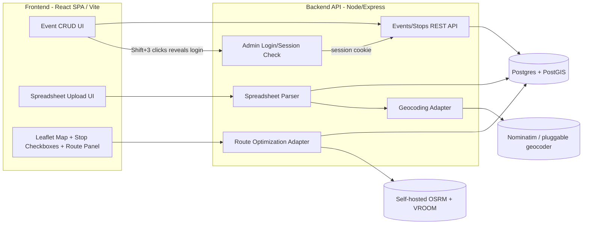

# Yard Sale Mapper — Roadmap

A web app for creating/managing yard-sale "events" (e.g. a town-wide yard sale),
uploading a spreadsheet of participating addresses, and generating the fastest
driving **circuit route** (start at home → hit every stop → return home).

---

## 1. Goals / Non-Goals

**Goals**
- CRUD for Yard Sale **Events** (name, date, description, status).
- Bulk-import stops via spreadsheet (CSV/XLSX) of addresses per event.
- Geocode addresses to lat/lng automatically, with a way to fix failures.
- Given an event + a user's starting address, let the user **check/select which
  stops they actually want to visit** (not necessarily all of them), then compute
  an optimized **round-trip** driving route over just that selection (a solved
  Traveling Salesman Problem over real road distances) when they click **"Calculate Route."**
- Visualize the event's stops and the computed route on an interactive map.
- Let the user hand off the final route to a real navigation app for turn-by-turn.

**Non-Goals (v1)**
- Real-time multi-driver dispatch / live tracking.
- Public social features (reviews, photos of items, chat).
- Perfect exact-optimal TSP for very large stop counts (heuristic is fine).

---

## 2. The Core Technical Problem

This is really two solved problems chained together:

1. **Geocoding** — turn addresses into coordinates.
2. **Open (or closed) TSP over a road network** — "visit all these points starting
   and ending at X with minimum drive time" — this is exactly the `Trip`/`Optimization`
   endpoint that open-source routing engines already provide. We don't need to hand-roll
   a TSP solver against straight-line distance; we want *real driving-time* distances,
   which means the routing engine must own both the distance matrix and the solve.

### Open-source routing options (recommended path)

| Engine | What it gives you | Notes |
|---|---|---|
| **OpenRouteService (ORS)** | Hosted free API; `/optimization` endpoint (built on VROOM) solves exactly this "jobs + vehicle start" VRP/TSP problem; also has geocoding & directions | Free tier: 3 vehicles / 50 jobs per request, 2000 req/day — plenty for MVP and most single-town events. Easiest to start with, no self-hosting. |
| **OSRM** (Open Source Routing Machine) | Self-hosted; `/trip` endpoint approximately solves round-trip TSP over real OSM road network | Very fast, but you host it (needs an OSM regional extract, e.g. state-level `.osm.pbf` + `osrm-extract`/`osrm-contract`). Good scaling path once you outgrow ORS free tier. |
| **VROOM** (self-hosted) | The actual optimizer ORS uses under the hood | Self-host if you need >50 stops or want no rate limits, without leaving pure open source. |
| **Google OR-Tools** | A library (not a hosted API) for solving VRP/TSP yourself given a distance matrix | Useful if you want to own the solver in-process, but you still need a distance matrix from somewhere (OSRM `/table` endpoint is a great free source of that matrix). |

**Recommendation:** Given the confirmed >25-stop (likely >50-stop) event sizes below,
go straight to **self-hosted OSRM + VROOM** for the solve, with **OSM Nominatim**
(or a pluggable geocoder) for addresses. It's more setup than the hosted ORS API,
but avoids hitting a free-tier wall right out of the gate. ORS hosted API can still
be handy as a zero-infra stand-in during the very earliest local prototyping, behind
the same adapter interface.

> **Decision (confirmed):** The flagship "town-wide yard sale" event type will
> routinely have **more than 25 stops**. This directly rules out Google Maps
> Platform's Routes API `optimizeWaypointOrder` feature, which is hard-capped at
> 25 waypoints per request (and even under that cap, using it forces the pricier
> "Pro" billing tier with only a 5,000 free requests/month allowance). Past 25
> stops, going the Google route would still require hand-rolling a TSP solver
> (e.g. OR-Tools) on top of paid `computeRouteMatrix` calls — the same engineering
> work ORS/VROOM already does for free. **Open-source routing is the confirmed
> path for the optimization/geocoding layers, and given the >25-stop (likely
> >50-stop) event sizes, self-hosted OSRM+VROOM is now planned from Phase 4
> onward rather than deferred to a later scaling phase** (see §5). Google Maps
> stays purely optional, as the "open in Google Maps to drive it" deep link
> described below (chunked into ≤10-stop legs).

### Where Google fits (kept optional, not core)

You likely don't need the Google Maps *JS SDK or Directions/Optimization APIs* at all,
and they cost money. Two lightweight, mostly-free integration points instead:

1. **Visual map display:** use **Leaflet + OpenStreetMap/MapTiler tiles** (free,
   no API key needed for light usage). This is fully sufficient for showing pins
   + a route polyline.
2. **"Open in Google Maps to actually drive":** once the route is computed, generate
   a **Google Maps deep link** (`https://www.google.com/maps/dir/?api=1&origin=...&destination=...&waypoints=A|B|C`)
   so the user taps one button and gets real turn-by-turn nav on their phone. This is
   free, key-less, and sidesteps Google's paid APIs entirely.
   - ⚠️ Caveat: Google's consumer deep link caps out around **9–10 total stops**
     (origin/destination + waypoints). For events with more stops than that, either
     (a) let Google Maps do turn-by-turn while your app shows the *next* stop and
     "send next leg" button, or (b) chunk the route into ≤10-stop legs, each opening
     sequentially.
3. If down the road you specifically want prettier satellite imagery or Google-grade
   geocoding accuracy, the map/geocoder layers below are built as swappable adapters,
   so Google Maps JS SDK / Google Geocoding API can be dropped in later without a rewrite.

---

## 3. Suggested Architecture



**Suggested stack**
- **Frontend:** React + TypeScript **single-page app built with Vite**, routed with
  React Router. Plain client-side rendering — no SSR, no hydration step.
- **Backend:** a separate small **Node + Express** API service (added in Phase 1),
  talking to Postgres and to the routing/geocoding engines. In dev, Vite proxies
  `/api/*` to it so the frontend still sees one origin.
- **Map:** `react-leaflet` + OSM/MapTiler tiles (swap to Google Maps JS SDK later
  behind a `MapProvider` interface if desired).
- **Database:** PostgreSQL + **PostGIS** (geospatial indexing on stop coordinates,
  handy for "nearby stops" queries later). ORM: Prisma or Drizzle.
- **Spreadsheet parsing:** `exceljs`/`xlsx` for `.xlsx`, `papaparse` for `.csv`.
- **Geocoding:** adapter interface (`GeocodeProvider`) with a default implementation
  hitting **Nominatim** (self-respect usage policy / rate limit to 1 req/sec, or use
  a low-cost provider like Geocodio/Mapbox for production volume).
- **Routing/optimization:** adapter interface (`RouteOptimizer`) with a default
  implementation calling self-hosted **OSRM `/route`** + **VROOM** for the solve;
  optionally an **ORS `/optimization`** implementation behind the same interface
  for quick local prototyping before the self-hosted engine is stood up.
- **Admin access:** No public accounts, no per-event owner tokens. A single shared
  **admin password** gates all CRUD. UI convenience: hold Shift and click the logo
  three times to reveal a login prompt (keeps the normal browsing UI clutter-free for regular
  visitors). Under the hood: a `POST /api/admin/login` route checks the password
  (hashed, stored in an env var) and sets an httpOnly, signed session cookie.
  Every mutating API route (`Event`/`Stop` create/update/delete) checks that
  session server-side — **the Shift+click gesture is just UI sugar to reach the prompt;
  the real security boundary is the server-side session check**, so it can't be
  bypassed by calling the API directly. Regular visitors get read-only browsing +
  route planning with no login at all.
- **Hosting:** any static host for the built SPA (Netlify/Cloudflare Pages/Vercel —
  it's just `dist/`, with a catch-all rewrite to `index.html` so deep links work)
  + Neon/Supabase (managed Postgres w/ PostGIS) + a small VPS/Fly.io/Render box
  running the Express API and the self-hosted OSRM+VROOM containers.

> **Decision (confirmed): plain React SPA, not Next.js.** The project started on
> Next.js 16 and hit two stability problems on Windows in the first day: the
> Turbopack dev server pegging CPU/RAM and hanging on "Compiling…", and an SSR
> **hydration mismatch** whose dev-mode error overlay silently swallowed clicks
> on the page underneath. Neither was worth eating, because Next was buying us
> nothing: every page was already `"use client"` with client-side state, so
> there was no SSR benefit to offset the SSR/hydration/bleeding-edge cost. Vite
> + React Router removes that entire class of bug (there is no server render to
> mismatch against) and builds the whole app in well under a second. SEO on
> public event pages is the one real trade-off; if that ever matters we can
> pre-render those pages or revisit, but it isn't a v1 goal.

---

## 4. Data Model (v1)

```
Event
  id, name, description, event_date, status (draft/published/archived),
  created_at, updated_at
  -- no owner_token: CRUD is gated by the single shared admin session, not per-event tokens

Stop  (one row per address, belongs to an Event)
  id, event_id, raw_address, label/notes,
  lat, lng, geocode_status (pending/ok/failed), geocode_provider,
  source_row (original spreadsheet row, for error reporting)

RouteRequest  (optional cache/history)
  id, event_id, start_address, start_lat, start_lng,
  selected_stop_ids (json)  -- the user's checked subset, as submitted
  ordered_stop_ids (json)   -- same stops, reordered by the optimizer
  total_distance_m, total_duration_s,
  geometry (encoded polyline / geojson), created_at

ImportJob  (optional, tracks spreadsheet uploads)
  id, event_id, filename, status, row_count, error_count, created_at
```

---

## 5. Phased Implementation Plan

### Phase 0 — Project setup
- [x] Init Vite + React + TypeScript SPA, Tailwind, ESLint, repo skeleton.
- [x] Vitest for unit tests (`npm test`). Worth pointing at pure logic like the
      route-leg chunking and, later, the geocode/optimizer adapters — a bad loop
      in `buildGoogleMapsRouteLegs` froze the browser mid-render once already.
- [x] **UI-only mockup pass:** every page, modal, and navigation path built
      against mock data and stubbed async functions in `src/lib/data-provider.tsx`,
      so the screens can be agreed on before any backend exists. Each stub already
      has the async signature its real API call will have — wiring the backend
      should only change the *insides* of those functions.
- [ ] Provision Postgres (+ PostGIS) — local Docker Compose for dev.
- [ ] Set up ORM (Prisma/Drizzle) with `Event`/`Stop` schema + migrations.

### Phase 1 — Admin gate + Event & Stop CRUD (no map yet)
- [ ] Stand up the Express API service; point Vite's dev proxy at it.
- [ ] Admin login: `POST /api/admin/login` checks a hashed password (env var),
      sets an httpOnly signed session cookie on success; `POST /api/admin/logout`.
- [x] Hidden UI trigger (Shift + 3 clicks on the logo) reveals the login prompt.
- [ ] Middleware/helper to require a valid admin session on every mutating route.
- [ ] API: create/list/get/update/delete Event — mutations require admin session;
      reads are public.
- [ ] API: create/list/update/delete Stop (manual single-address entry) — same gate.
- [ ] Basic UI: public event list/detail pages; add/edit/delete controls only
      rendered (and only actually authorized) in admin mode.

### Phase 2 — Spreadsheet import + geocoding
- [ ] Upload UI (drag/drop `.csv`/`.xlsx`), column mapping (address, label/notes).
- [ ] Parse rows → create `Stop`s with `geocode_status = pending`.
- [ ] Geocoding worker: batch geocode pending stops (rate-limited), store lat/lng.
- [ ] Import report UI: show failed rows, allow manual address fix + re-geocode.

### Phase 3 — Map visualization + stop selection
- [ ] Integrate `react-leaflet` + tile provider; render an event's stops as pins.
- [ ] Popups with stop label/address; basic clustering if many stops.
- [ ] **Selectable stops:** checkbox per pin (on the map popup and in an
      accompanying list panel, kept in sync both ways), plus "select all" /
      "select none" convenience controls. Selection state lives client-side
      (e.g. a `Set<stopId>`) until the user is ready to route.

### Phase 4 — Self-hosted routing engine + route optimization ("the circuit")
- [ ] Stand up self-hosted routing via Docker Compose: **OSRM** (regional OSM
      `.osm.pbf` extract → `osrm-extract`/`osrm-partition`/`osrm-customize`) +
      **VROOM** pointed at it for the optimization solve. (Optionally wire up
      the hosted ORS `/optimization` API first, behind the same adapter, if you
      want something working before the self-hosted engine is stood up.)
- [ ] UI: pick an event, enter/geocode a starting address, check the stops to
      visit from Phase 3's selection UI, then click an explicit **"Calculate
      Route"** button — routing only runs on that click, never automatically
      on every checkbox toggle.
- [ ] `RouteOptimizer` adapter → call VROOM (start = end = home, jobs = only the
      **selected** stop IDs from the request) → get ordered stop list + total
      distance/duration. Reject/warn on zero stops selected.
- [ ] Fetch actual route geometry from OSRM `/route` using the optimized order,
      draw the polyline on the map (dim/hide unselected stops while a route is shown).
- [ ] Results panel: ordered stop list, ETA/leg distances, total trip summary.
- [ ] "Open in Google Maps" deep-link button (chunk into ≤10-stop legs if needed).
- [ ] Allow editing the selection and re-clicking "Calculate Route" to recompute.

### Phase 5 — Polish
- [ ] Handle geocode failures gracefully (exclude from route, flag in UI).
- [ ] Mobile-responsive layout; loading/error states throughout.
- [ ] Cache/persist computed `RouteRequest`s so revisits don't recompute.

### Phase 6 — Multi-admin support (optional, only if one shared password stops being enough)
- [ ] Replace/augment the single shared password with per-admin accounts
      (NextAuth/Clerk or a simple users table) if more than one trusted person
      needs distinguishable access, or you want audit trails on who edited what.
- [ ] Public read-only event pages stay as-is either way.

### Phase 7 — Scaling / hardening
- [ ] Background job queue (e.g. BullMQ + Redis) for large imports instead of inline geocoding.
- [ ] Swappable geocoder/router adapters documented for future Google Maps drop-in.
- [ ] Harden the OSRM+VROOM box (resource sizing, extract refresh process, backups).

### Phase 8 — Stretch ideas
- [ ] Multiple starting points comparison ("fastest from home vs. from work").
- [ ] Time-window aware routing (skip sales not open yet).
- [ ] Favorite/star stops, printable route sheet, PWA offline support.

---

## 6. Open Questions

- ~~Do event owners need real accounts, or is a shareable secret edit-link enough for v1?~~
  **Resolved:** neither — a single shared admin password (Shift+3-clicks-to-reveal
  login) gates all CRUD; no per-user accounts or per-event tokens for v1.
- ~~What's the realistic max stop count per event?~~ **Resolved:** town-wide events
  routinely exceed 25 stops and likely exceed ORS's 50-stop free-tier cap too — moved
  self-hosted OSRM+VROOM setup up to Phase 4 instead of deferring it to scaling work.
- Spreadsheet format: fixed column names, or a mapping step so users can upload whatever export they have?
- Do we need to persist historical routes per user, or is "compute on demand" enough?
